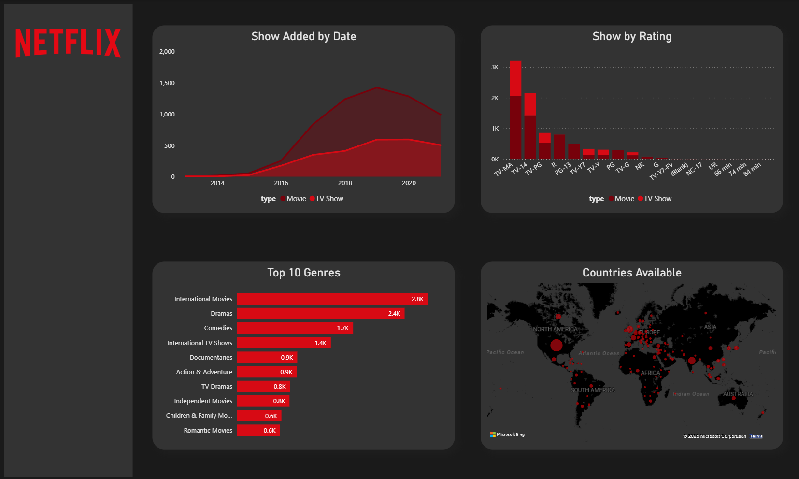
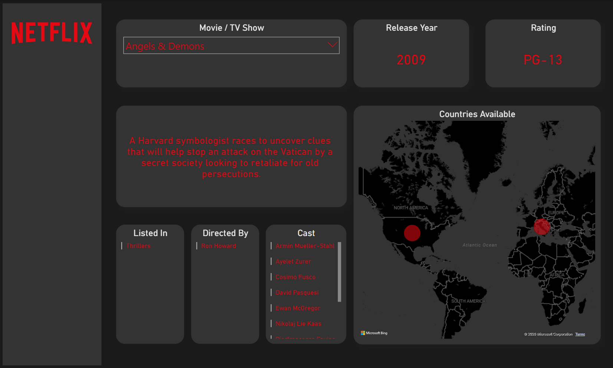

# 🎬 Netflix Data Analysis & Data Cleaning Project

## 📌 Deskripsi Project
Project ini merupakan proses **data cleaning**, **data transformation**, dan **data analysis** menggunakan dataset Netflix Movies & TV Shows. Proses dilakukan menggunakan Microsoft Excel dengan tujuan menghasilkan dataset yang lebih terstruktur dan siap digunakan untuk analisis bisnis maupun visualisasi dashboard.

Pada project ini dilakukan:
- Pembersihan data (*data cleaning*)
- Menghapus blank spaces
- Menangani missing values
- Repivoting data untuk memisahkan cast, director, dan category menjadi tabel baru
- Membuat unique key untuk identifikasi data
- Analisis data menggunakan Pivot Table dan VLOOKUP di Excel
- Pembuatan dashboard visual untuk mendapatkan insight bisnis

---

# 📷 Dashboard Preview

## 📊 Overview Dashboard



---

## 🎥 Single Title View Dashboard



---

# 🎯 Tujuan Project
- Membersihkan dataset Netflix agar lebih konsisten dan siap dianalisis
- Memisahkan data multi-value seperti cast dan director menjadi struktur yang lebih optimal
- Menganalisis tren konten Netflix berdasarkan:
  - tipe konten
  - negara
  - genre
  - rating
  - tahun rilis
- Membantu memahami pola distribusi konten Netflix melalui visualisasi data

---

# 🗂️ Dataset Information

Dataset terdiri dari beberapa kolom utama:

| Kolom | Deskripsi |
|---|---|
| show_id | ID unik setiap konten |
| type | Jenis konten (Movie / TV Show) |
| title | Judul konten |
| director | Nama sutradara |
| cast | Daftar pemeran |
| country | Negara produksi |
| date_added | Tanggal ditambahkan ke Netflix |
| release_year | Tahun rilis |
| rating | Rating usia |
| duration | Durasi film/show |
| listed_in | Genre kategori |
| description | Deskripsi konten |

---

# 🛠️ Tools & Technologies
- :contentReference[oaicite:0]{index=0}
- Pivot Table
- VLOOKUP
- Data Cleaning
- Data Transformation

---

# 📊 Data Cleaning Process

## ✅ 1. Trimming Blank Spaces
Membersihkan spasi berlebih pada kolom seperti:
- title
- director
- cast
- country

Tujuan:
- Menghindari duplicate value
- Menjaga konsistensi data

---

## ✅ 2. Handling Missing Values
Menangani data kosong pada beberapa kolom:
- director
- cast
- country
- date_added

Tujuan:
- Memastikan data lebih valid untuk analisis

---

## ✅ 3. Repivoting Data
Kolom seperti:
- cast
- director
- listed_in

dipisahkan menjadi beberapa tabel baru agar:
- setiap data memiliki unique key
- relasi data lebih optimal
- memudahkan filtering dan analisis

---

## ✅ 4. Data Analysis with Excel
Analisis dilakukan menggunakan:
- Pivot Table
- VLOOKUP
- Aggregation
- Filtering

---

# 📈 Dashboard Features

Dashboard menampilkan:
- Total Movies & TV Shows
- Distribusi rating
- Distribusi genre
- Negara dengan jumlah konten terbanyak
- Analisis tahun rilis
- Detail informasi setiap title

---

# 📌 Business Insight

## 1. Dominasi Konten Movie
Berdasarkan analisis, jumlah konten dengan tipe **Movie** jauh lebih banyak dibandingkan TV Show.

### Insight:
- Netflix lebih fokus pada distribusi film dibanding serial TV.
- Movie menjadi kategori utama dalam katalog platform.

---

## 2. Negara dengan Produksi Konten Tertinggi
Beberapa negara mendominasi jumlah konten Netflix.

### Insight:
- Amerika Serikat menjadi kontributor utama konten Netflix.
- Negara lain seperti India dan UK juga memiliki kontribusi besar terhadap library Netflix.

Hal ini menunjukkan:
- dominasi industri entertainment tertentu,
- serta target market global Netflix.

---

## 3. Genre dengan Popularitas Tinggi
Analisis genre menunjukkan beberapa kategori memiliki jumlah konten lebih tinggi dibanding genre lainnya.

### Insight:
- Genre seperti Drama, Comedy, dan International Movies mendominasi platform.
- Netflix cenderung fokus pada genre dengan audience terbesar.

---

## 4. Tren Penambahan Konten
Analisis date_added menunjukkan peningkatan jumlah konten dari tahun ke tahun.

### Insight:
- Netflix terus melakukan ekspansi library konten secara agresif.
- Pertumbuhan konten meningkat signifikan pada periode tertentu.

---

## 5. Analisis Rating Konten
Distribusi rating menunjukkan mayoritas konten berada pada kategori:
- TV-MA
- TV-14

### Insight:
- Sebagian besar konten Netflix ditargetkan untuk remaja dan dewasa.
- Segmentasi audience dewasa menjadi fokus utama platform.

---

## 6. Pentingnya Data Transformation
Kolom seperti cast dan director awalnya memiliki multiple values dalam satu cell.

### Insight:
Dengan melakukan repivoting:
- analisis actor/director menjadi lebih akurat,
- hubungan antar data lebih jelas,
- dan proses filtering dashboard menjadi lebih optimal.

---

# 📌 Kesimpulan
Project ini menunjukkan bagaimana proses data cleaning dan transformation sangat penting sebelum melakukan analisis data.

Melalui dashboard dan analisis yang dilakukan:
- data menjadi lebih konsisten,
- lebih mudah dianalisis,
- serta mampu menghasilkan insight bisnis yang lebih akurat.

Project ini juga menunjukkan penggunaan Excel tidak hanya sebagai spreadsheet biasa, tetapi juga sebagai tools untuk:
- data cleaning,
- relational transformation,
- dashboarding,
- dan business analysis.

---

# 📂 Struktur Project

```bash
Netflix-Analisis/
│
├── Dashboard/
│   ├── Overview.png
│   ├── Single_Title_View.png
│
├── Data/
│   ├── Clean Data
│   ├── netflix_titles.csv
│
├── Power_BI/
│   ├── netflix-dashboard.pbix
│
├── ERD/
│   ├── Netflix_ER Diagram.drawio
│
├── README.md
